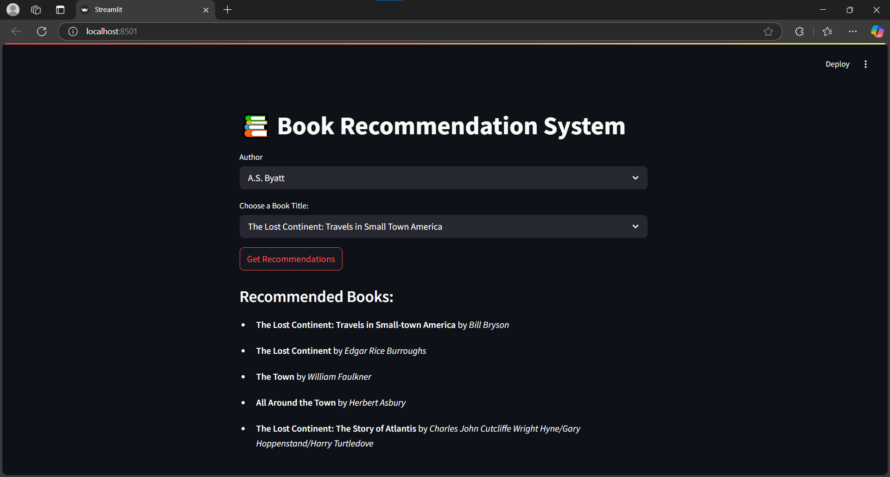

# 📚 Book Recommendation System

A content-based book recommender built using **Python**, **Pandas**, **Scikit-learn**, and **Streamlit**. This app recommends books based on their title using **TF-IDF text similarity**.

 <!-- Optional: add a screenshot file named preview.png -->

---

## 🚀 Features

- 🔍 **Content-based filtering** using TF-IDF
- 📖 **All books always visible** — no restrictive filtering
- 👤 **Optional author highlight** (purely informative)
- 💡 **Top 5 book recommendations** based on the selected title
- ⚡ Built with **Streamlit** for an instant web interface

---

## 🗂️ Project Structure

book-recommender/
├── 📄 book_app.py           # ✅ Main Streamlit application script
├── 📄 books_data.csv        # 📚 CSV file containing book titles and authors
├── 📄 requirements.txt      # 📦 All Python dependencies for the project
├── 📄 README.md             # 📘 Project documentation (you’re reading it!)
├── 🖼️ preview.png           # 🌄 Screenshot of the app UI 
